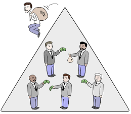
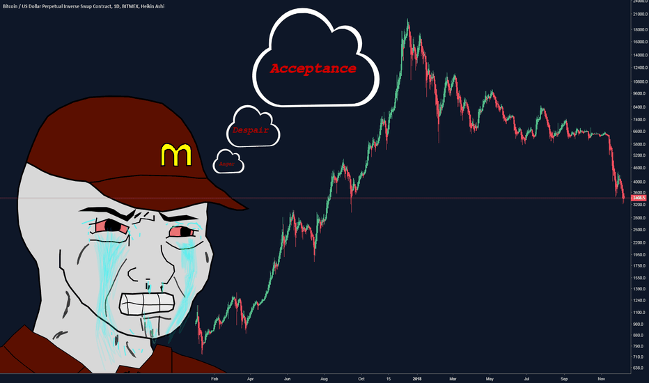
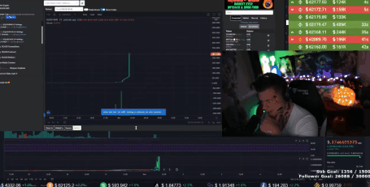
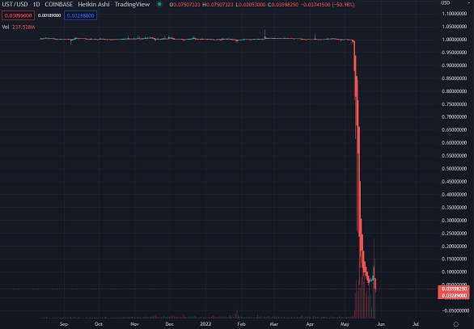

# FW trading compendium

## General trading philosophies

Every market is a ponzi scheme, it is just a matter of perspective and timeframe. You need buyers to come in after you to make profit (when trading on spot markets). 

For every successful trade you make, there will be an unsuccessful trade on the other side of it.

No strategy is 100% accurate, trades should be made on expected probabilities of movements, with capital being managed appropriately for the risk level.

## Markets

### Spot market

This is simple buying and selling between parties. 

There are typically several transaction types available on spot markets:

| Order type| Description |
|---|---|
| Market buy/sell | Buys/sells instantly. The transaction price may not be the same as the listed price. The exchange will match market orders with the closest available limit order. Market orders may fulfil at multiple prices if multiple limits were hit. |
| Limit buy/sell | Sets a price for buying/selling. You will have to wait for the price to reach the limit and for the exchange to match a market sale to your limit order. Order fills are never guaranteed even if your limit price is reached. Try to avoid placing limit orders at popular levels, place them just above/below (e.g. 9.998 instead of 10.0).|
| Stop market buy/sell | This is a safety order. If you hold a coin and the price falls below a set limit, a market sell will be made. |
| Stop limit buy/sell | Similar to the stop market buy/sell, however a limit order is placed when the price reaches the stop limit.|

### Futures market

### Leveraged tokens

### Options

### Margin trading

### Wojak strategy

* Wojak is always in a bad mood when trading
* He is constantly frustrated that most of his trades go against him
* He chases green candles, hoping they will continue upward
* He doesn't follow his own trading strategies or risk management strategies
* He forgets to sell when he is in profit, thinking he can make more profit
* When Wojak is in the red on a trade, his recovery strategy is hope, he ends up panic selling at a huge loss, just before the market recovers.

### The patient wolf - buy the dip, sell the tip

There are multiple ways to approach this philosophy, each of which involves buying coins at a discount and selling high.

Some useful ways to identify good entries and exits are outlined below:

* Analysing fear and greed in the market
* Identifying key support and resistance levels

### The smart wolf - continuous profit

Volatility is the smart wolf's friend

## Technical analysis

### Retail indicators

I will be frank... retail indicators are bollocks, especially on low time frames.

#### Oscillators

##### MACD - moving average convergence divergence

Probably the most well known oscillator, many retailers probably have a MACD oscillator on their exchange charts, most likely with the default values supplied by the exchange.

#### Moving averages

#### Fancy stuff

### Complex indicators

####

## Macro-economics

## Smart money

### Insider trading

### Hiding their buys and sells

### Traps

### Market manipulation

## Risk management

## Research

### How to spot a scam coin

Some potential indicators that a coin/project may not be reputable:

* The coin is listed on Poocoin.
* The coin attempts to capitalise on some recent trends (e.g. Squid Game Token, Depp Coin).
* The token uses a similar name to an existing coin.
* The developers do not show their real names or faces.
* There are no partners or institutional funding for the project.
* There is no activity on the project's Github, or they do not have a public development portal.
* If something is too good to be true, it is probably not true/
  * Be particularly wary of staking schemes with very high APY, if you get in early you *might* come out in profit, if not then you are essentially funding an early bird's exit. In order to achieve these APYs, they need a continuous flow of new money (see [Wonderland/TIME](https://cyberbump.net/wonderland-time-crypto-instant-millionaires-or-ponzi-scheme/)).
  * Staking should form some function for the operation of the blockchain, not just a pointless 'reward' system.

## Metrics

### On-chain metrics

### Long/short ratio

### Order book

## Stablecoins

This time last year, I never imagined doing TA on and scalping stablecoins. If you have been asleep this year, look into the LUNA / UST fiasco.

### $UST - Terra US dollar

This chart above is a stablecoin. It is supposed to be valued at $1, and at the time of writing is priced at 3 cents. During this time, the UST's blockchain coin LUNA lost in excess of 99% of its value for 3 consecutive days, dumping from $80 to $0.0001. Exchanges were literally scrambling to add zeros to the LUNA ticker.

A lot of people lost a lot of money holding this coin.

The problem arose because of a fundamental design flaw in the Terra ecosystem.

See [here](https://www.cnet.com/personal-finance/crypto/luna-crypto-crash-how-ust-broke-and-whats-next-for-terra/) for a full explanation of how the depeg happened.

### $USDT - Tether

### $USDC - 
### $BUSD - Binance USD 
### $DAI -

## Algorithmic trading

### Strategy trading

### Grid trading - Grids are orders placed above and below a set price, creating a grid of orders at incrementally increasing and decreasing prices.  These techniques can be fully automated (AI) or semi automated (User Defined).  Exchanges and 3rd party trading tools can faciliate a grid strategy.   FW prefer 3COMMAS, but also have experience using others.   Grids can be set "wide" or "tight".   Each with their own respective risks and rewards.   Wide grids allow broad coverage across price ranges and require less user oversight.   Tight grids are focused, narrow, price ranges.  They can yield higher returns but will most likely require more user intervention, specifically when the asset price falls below the defined ranges.  

### The pinnacle - hybrid strategy and grid trading

## Useful resources

### Videos / channels

### Guides / tutorials
